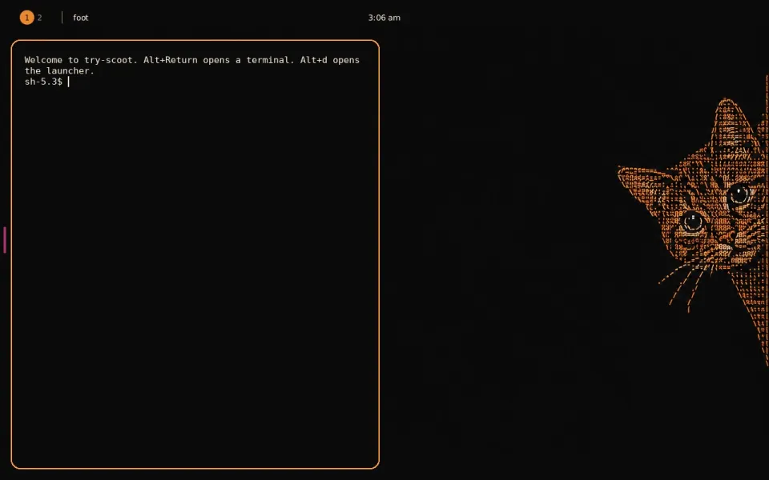

```sh
docker run --rm -p 127.0.0.1:6080:6080 ghcr.io/scoot-sh/try-scoot
# open http://localhost:6080/ -- no client install
```

# try-scoot



The smallest fast way to try scoot: a lightweight desktop running the scoot
compositor from the scoot flake, in your browser. No GPU needed (scoot's
pixman path, software capture); no client install.

What you see is scoot's `ginger-night` look (the cat-peeking desktop
default, black field with one ginger accent): the wallpaper placed with
`scootbg` `fit` on its black fill so the cat is never cropped, ginger
focus rings, the floating translucent bar, the foot palette, the themed
launcher and the Vanilla-DMZ cursor. The look is read live from the scoot
flake input (`docs/examples/ginger-night/` plus the `ginger-night` entry in
`nix/modules/desktop.nix`), so bumping `inputs.scoot` moves the image with
it; see `nix/ginger-night.nix` for exactly what follows. Two deliberate
divergences: the terminal font stays DejaVu Sans Mono (the look tunes with
FiraCode Nerd Font, not shipped) and the bar keeps a minimal module set
(workspaces + window title + clock, no Nerd-glyph icons or load/cpu
daemons). Full screenshots in `docs/ginger-night-default.png` (VNC) and
`docs/ginger-night-selkies.png` (Selkies, same desktop).

What drove scoot: a no-GPU webtop you can open in a browser, and a desktop an
agent can drive as easily as a person (scoot's control socket). This image is
the "try it" visit: a terminal, the launcher, the bar, and the ginger-night
look. Nothing else.

## Look

The session look is `ginger-night` and only `ginger-night`: there is no env
var to pick another scoot look. That is deliberate, not a missing knob --
another look would need its whole registry in the image (palettes, app
files, wallpaper bytes for five looks) plus a runtime switch that re-seeds
every config; the image instead reads the one look from the flake at build
time and follows it on bump. To try a different look, run scoot itself with
that example's files (see the look's README in the scoot repo). Out of
scope by design: per-look wallpapers beyond ginger-night's CatPeeking file
(the `look-no-third-party` check pins it by name and sha256 so any other
image fails), Nerd-Font icons, and the look's load/cpu/network/volume
daemons.

## Run

```sh
docker run --rm -p 127.0.0.1:6080:6080 ghcr.io/scoot-sh/try-scoot
```

Open `http://localhost:6080/`. The page forwards to the noVNC client
(autoconnect, scale to window, reconnect). Native VNC clients use port 5900,
which binds container loopback by default: publishing it with
`-p 5900:5900` alone is not enough (the listener stays on loopback, so the
mapping accepts then EOFs) -- add `-e VNC_LISTEN=0.0.0.0` to reach it from
outside the container.

The one-liner above is the whole story: the image needs no `--shm-size`
(the browser-side canvas lives in the *host* browser, and the container runs
fine with the runtime default) and no named volume (a `/config` volume only
matters if you want your config edits to survive `--rm`;
add `-v try-scoot-config:/config` for that).

Size it with `VNC_WIDTH`/`VNC_HEIGHT` (default `1280x800`). `VNC_FPS`
(default `30`) caps the capture rate. `VNC_KEYBOARD` picks a wayvnc keyboard
layout. `VNC_LISTEN` (default `localhost`) and `VNC_PORT` (default `5900`)
control the VNC listener -- both are honored: the wayvnc service listens on
`$VNC_LISTEN:$VNC_PORT` (a bare host gets `:$VNC_PORT` appended) and the
in-container noVNC proxy dials the same target (`0.0.0.0` maps back to
`localhost`; a `VNC_LISTEN` holding a unix socket path is unsupported and
the browser service refuses to start loudly rather than dialing the wrong
port). `NOVNC_LISTEN`
(default `0.0.0.0`) and `NOVNC_PORT` (default `6080`) control the browser
port.

Keys: `Alt+Return` / `Super+Return` / `Alt+t` / `Super+t` terminal, `Alt+d` /
`Super+d` launcher, `Alt+q` / `Super+q` close, `Alt+h` / `Alt+l` (and the
`Super` mirrors) move focus between columns. `Super` doubles every `Alt` bind
because some browsers/OSes grab `Alt` chords (and some grab `Super`/Cmd) --
inside a terminal prefer the `Super` binds (readline owns `Alt+d` and friends).

Remote chords fire: the image sets `[virtual_input] binds = true` (with
`enabled = true`, restart-only -- see scoot `remote-desktop.md`), so
virtual-keyboard keys run compositor binds, matched by translated seat
keysym. Proven live with a scripted RFB client driving the wayvnc port and
headless Chromium through noVNC: `Alt+Return` 1 -> 2 windows, `Super+Return`
2 -> 3, `Alt+d` respawns fuzzel after a kill, `Alt+h` / `Alt+l` move focus
(RFB 3 -> 2 -> 3; browser 4 -> 1 -> 2), typing still works (RFB
`touch /tmp/vnctypeok` creates the file; browser `echo hello-browser`
types). `scoot msg locked` was `false` for the proof; while locked, virtual
motion/buttons/keys (including binds) are dropped and can never unlock.
Browser-side limits remain: a browser/OS that grabs a chord never sends it,
so click the canvas first and try the `Super` mirror when `Alt` is eaten.
The fallback that always works is the control socket from inside the
container: `docker exec -u abc -e XDG_RUNTIME_DIR=/run/user/911 <c> scoot msg key alt+Return`
(and `scoot msg pointer`). Details and evidence in docs/benchmark.md.

## Ports and security

No password is set by default, so keep the browser port on loopback as in
the one-liner above (`-p 127.0.0.1:6080:6080`). To reach it from elsewhere,
tunnel over `ssh -L 6080:localhost:6080` (the tunnel keeps `Host:
localhost:6080`, so it passes the Host pin).

The WebSocket upgrade pins the served Host against DNS rebinding: only
`localhost`, `127.0.0.1`, or `[::1]` (any port, so Docker `-p 6081:6080`
mappings and `ssh -L` local ports keep working) connect by default.
Opening the desktop by LAN IP or another hostname needs
`WSBRIDGE_ALLOW_HOST` (comma-separated `host[:port]`, empty by default):

```sh
docker run --rm -p 6080:6080 -e WSBRIDGE_ALLOW_HOST=192.168.1.5:6080 ghcr.io/scoot-sh/try-scoot
# or -e WSBRIDGE_ALLOW_HOST=myhost for any port / multiple: -e WSBRIDGE_ALLOW_HOST=myhost,192.168.1.5:6080
```

A bare hostname allows any port; a `host:port` entry requires that exact
port. A non-default browser port (`-e NOVNC_PORT=6081 -p 127.0.0.1:6081:6081`)
keeps working on `localhost` because the pin exempts loopback names at any port. Without
a listing the upgrade gets 403 (`host not allowed (set WSBRIDGE_ALLOW_HOST
to allow this host)`) and the log names the variable once.

`VNC_PASSWORD` enables wayvnc password auth (fail-closed: setting it always
protects the port, never starts open). With `[virtual_input] binds = true`,
any remote client that can reach the VNC port can now also spawn programs and
run compositor actions through binds (a terminal, the launcher) -- not just
type and click -- so treat VNC reach as shell-equivalent and keep it on
loopback or behind `ssh -L` unless the remote user owns the session. The
service writes a wayvnc config
with password auth; noVNC in a browser prompts for the password (proven
end-to-end with headless Chromium: prompt -> desktop), classic native
clients use DES, macOS Screen Sharing uses Apple-DH. Deliberately no TLS
keys are configured: wayvnc's VeNCrypt handshake is unusable by noVNC (it
fails the version exchange before any prompt), so TLS credentials would
protect native clients while bricking the browser path -- see
docs/security.md for the measured handshake table. Neither the browser nor
the DES path encrypts, and DES uses the first 8 password characters, so keep
passwords short and tunnel over SSH on untrusted networks. `VNC_USER`
(default empty) sets the wayvnc username; the browser prompt only asks for
the password in practice. Full posture in docs/security.md.

Clipboard paste above 1 MiB drops the connection (1 MiB frame cap, close
1009); reconnect recovers and typical pastes (KBs) are unaffected.

The container runs the session as non-root user `abc` (uid 911). The VNC
port binds loopback only by default; the browser port is the only one the
one-liner publishes. The one-liner's trust posture is unchanged by `binds`:
loopback-only default with an optional `VNC_PASSWORD` (loopback-grade, tunnel
over SSH on untrusted nets) -- what changes is only what VNC reach implies
once it happens (binds can now spawn), which is why the loopback default
matters more, not less. WebRTC is not used here, so there are no UDP ports,
STUN/TURN servers, or host-networking needs: one TCP port carries the whole
desktop.

## Selkies variant (`:selkies`, experimental)

A second, opt-in image streams the same desktop through Selkies (software
H.264 + audio) instead of VNC. The one-liner above stays the default; this
is the clearly labeled second option:

```sh
docker run --rm -p 127.0.0.1:8080:8080 ghcr.io/scoot-sh/try-scoot:selkies
docker logs <container>  # generated password (use the last GENERATED line); open http://localhost:8080/
```

Trade-offs, measured (see docs/selkies.md for method): ~491 MiB pull and
~1.63 GiB unpacked (vs ~177 MiB / ~566 MiB for this tag), ~0.2% / ~119
MiB idle without a viewer (vs ~0% / ~43 MiB) and 27-48% / ~143 MiB with
a viewer attached and actively streaming (software x264 at 60 fps -- the
expected cost), `docker run` to painted desktop ~2 s in a
browser. What you gain is audio (VNC has none) and H.264 motion
efficiency; what you pay is a bigger image (the GL + Python + PulseAudio
stack the VNC tag deleted on purpose), a busier streaming idle, and a
second port family if you switch it to WebRTC mode. The server is
fail-closed by default: with no password it generates one, prints it once
to `docker logs`, and keeps the login on -- so keep the port on loopback
exactly as with the default tag and read the log; `-e
SELKIES_BASIC_AUTH_PASSWORD='...'` sets your own (a set password never
starts open; a wrong one gets 401); `-e TRY_SCOOT_INSECURE_OPEN=1` is the
explicit loopback-only open mode. The server cannot tell a rebound Host
apart, so auth is the defense. File transfers are off by default
(`SELKIES_FILE_TRANSFERS=upload,download` opts back in); recording has no
upstream off switch and stays behind the login.
Typing and pointing arrive over remote input AND compositor chords fire
(proven live: remote Alt+Return spawns a terminal) -- remote reach is
shell-equivalent, so keep it on loopback or behind a password, mirroring
the default tag's posture since PR #2. Full posture, modes, and packaging notes in
docs/selkies.md.

## Build

With Nix on Linux:

```sh
nix build .#image-try-scoot && docker load < result
```

Images are `dockerTools.buildLayeredImage` outputs for `x86_64-linux` and
`aarch64-linux`. `nix flake check` runs the look-hygiene check (no vendored
images under `rootfs/`; the ginger-night wallpaper from the scoot input
pinned by name and sha256). See docs/ for layers, measurements, and the Selkies
packaging decision.

CI pushes per-arch tags on every `main` push (`:x86_64-linux`,
`:aarch64-linux`, combined into `:latest`) and `pr-<N>-<shortsha>-<system>`
per-arch tags on pull requests from this repo, so the `ghcr.io/…` one-liner is
testable before merge. Builds read the `scoot-sh` Cachix cache
(read-only); pushing to it is a maintainer job needing a `CACHIX_AUTH_TOKEN`
secret, which is deliberately not wired into CI here.

## How it relates to scoot and to nixos-webtop

scoot (`github:scoot-sh/scoot`) ships the compositor, `scootbar`, and
`scootbg`; this image consumes that flake (`inputs.scoot`, nixpkgs followed
so the image carries one stack) and runs headless scoot directly, captured
by wayvnc. The desktop profile's shape (bar, wallpaper, launcher, terminal)
mirrors `programs.scoot.desktop`, but the container does not run NixOS
modules: it seeds plain config files.

`yackey-labs/nixos-webtop` is the inspiration, not the source: it taught us
the pieces (flake-built images, headless scoot + wayvnc + noVNC, input and
look seeding), but every file here is written fresh for this repo under MIT.
No browser, file manager, or dev tools ship here beyond the "try it" visit.
